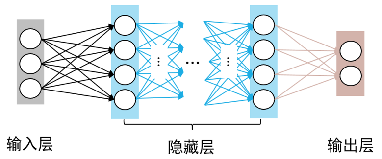

## 神经网络的结构
神经网络的结构由三部分构成，分别是输入层、隐藏层和输出层。输入层用于接受外部的数据输入；隐藏层是中间的处理层，可以有多层；输出层输出最后的处理结果。

## 神经元
神经元(neuron)是神经网络的基本计算单元，也被乘坐节点(node)或者单元(unit)。神经元的每个输入都有一个权重(weight)，权重的大小取决于这个输入相比于其他输入值的重要性，图中值为1权重为b的输入是偏置值bias，函数f是被称为激活函数的非线性函数。

## 单层感知机
单层感知机由一个输入层和一个输出层构成，输入层负责接受实数值的输入向量，输出层为1或-1两个实数值。单层感知机可以作为一种**二分类线性分类模型**.  

单层感知机模型:  
$f(x) = sign(w * x + b)$

给定一个n维数据集，如果他可以被一个超平面完全分割，那么我们称这个数据集为线性科菲数据集，否则为线性不可分的数据集。三层感知机只能处理线性可分数据集，其任务是寻找一个线性可分的超平面将所有的正类和负类划分到超平面两侧。  
单层感知机和逻辑回归的主要不同在于激活函数和损失函数。在逻辑回归中通常使用sigmoid函数作为激活函数，而在单层感知机中激活函数为sign函数。单层感知机使用sign作为激活函数，不像sigmoid函数那样以一定概率对结果进行输出，所以单层感知机效果与逻辑回归相比较差，泛化能力较差。逻辑回归的损失函数通常训勇交叉熵损失函数，也可以选用均方差损失函数，而单层敢直接则是基于五分类点到超平面的剧烈综合来构建损失函数。

[单层感知机](https://paddlepedia.readthedocs.io/en/latest/tutorials/deep_learning/basic_concepts/single_layer_perceptron.html)  
[单层感知机(Single Layer Perceptron)详解](https://blog.csdn.net/weixin_60737527/article/details/125455264)
[单层感知机](https://www.cnblogs.com/-wenli/p/12826272.html)

## 逻辑回归
一种广义的xianxingh8uigui分析模型，属于机器学习中的监督学习。实际上主要用来解决二分类问题。  
[逻辑回归(Logistic Regression)详解](https://blog.csdn.net/weixin_60737527/article/details/124141293?spm=1001.2014.3001.5502)

## k-means算法
K均值聚类是多元统计分析中的聚类分析部分内容，也是机器学习的基础算法。其目的是将无标签数据进行分类。
[k均值(k-means)聚类](https://blog.csdn.net/weixin_60737527/article/details/124230381?spm=1001.2014.3001.5502)

## 多层感知机(MLP)
由于单层感知机无法模拟诸如异或等复杂函数，其应用较为单一。通过在感知机模型中增加若干隐藏层，增强神经网络的非线性表达能力，可以使神经网络具有更强的你和能力。因此，由多个隐藏层构成的多层感知机被提出。  

多层感知机中，相邻层所包含的神经元之间通常使用“全连接”方式进行连接。多层感知机可以模拟复杂的非线性函数功能。所模拟函数的复杂性取决于网络隐藏层数目和各层中神经元数目。

### BP算法
BP算法是BP神经网络的核心，需要构造损失函数，然后求损失函数对各个参数的偏导数，利用梯度下降算法不断调整参数，进而达到训练神经网络的目的。由于在多层感知机中，神经元的层数增加，信号逐层传递，各个全职、偏置等参数众多，需要实际部分矩阵求导等知识，求解更加复杂。

[多层感知机](https://paddlepedia.readthedocs.io/en/latest/tutorials/deep_learning/basic_concepts/multilayer_perceptron.html)  
[多层感知机（MLP）、全连接神经网络（FCNN）、前馈神经网络（FNN）、深度神经网络（DNN）与BP算法详解](https://blog.csdn.net/weixin_60737527/article/details/125469221?spm=1001.2014.3001.5501)

## 支持向量机
支持向量机(SVM)是在统计学习理论基础上发展起来的一种数据挖掘方法，是机器学习中的方法之一，也是核方法(kernel method)中最有名的方法之一，在小样本、非线性和高位的回归分类问题上有许多优势。支持向量机可以分为支持向量机分类(support vector classification, SVC)与支持向量机回归(support vector regression, SVR)  
[基于scikit-learn支持向量机的实现](https://blog.csdn.net/weixin_60737527/article/details/126170049?spm=1001.2014.3001.5501)

## 决策树
决策树属于监督学习的一种。通过给定的训练数据，计算各种情况发生的概率，在此基础上荀泽合适的划分并构造决策树，用于数据类别的预测判断，或者也可以进行数据的你和回归。  

[决策树基本原理与基于sciki-learn的实现](https://blog.csdn.net/weixin_60737527/article/details/126310756?spm=1001.2014.3001.5501)

[1] [神经网络的基本原理是什么](https://www.zhihu.com/question/562270490/answer/3250702047)
[2] [一文了解神经网络的基本原理](https://zhuanlan.zhihu.com/p/68624851)