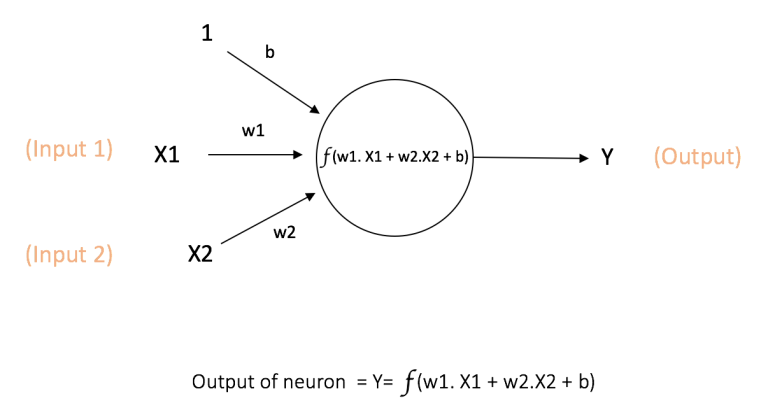
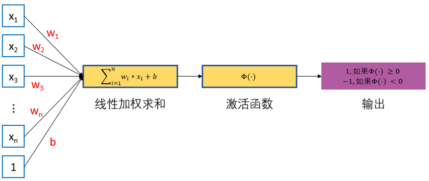

## 神经网络的结构
神经网络的结构由三部分构成，分别是输入层、隐藏层和输出层。输入层用于接受外部的数据输入；隐藏层是中间的处理层，可以有多层；输出层输出最后的处理结果。

## 神经元
神经元(neuron)是神经网络的基本计算单元，也被乘坐节点(node)或者单元(unit)。神经元的每个输入都有一个权重(weight)，权重的大小取决于这个输入相比于其他输入值的重要性，图中值为1权重为b的输入是偏置值bias，函数f是被称为激活函数的非线性函数。

## 单层感知机
单层感知机由一个输入层和一个输出层构成，输入层负责接受实数值的输入向量，输出层为1或-1两个实数值。单层感知机可以作为一种**二分类线性分类模型**.  

单层感知机模型:  
$f(x) = sign(w * x + b)$

给定一个n维数据集，如果他可以被一个超平面完全分割，那么我们称这个数据集为线性科菲数据集，否则为线性不可分的数据集。三层感知机只能处理线性可分数据集，其任务是寻找一个线性可分的超平面将所有的正类和负类划分到超平面两侧。

## 多层感知机(MLP)
xx

[1] [神经网络的基本原理是什么](https://www.zhihu.com/question/562270490/answer/3250702047)
[2] [一文了解神经网络的基本原理](https://zhuanlan.zhihu.com/p/68624851)