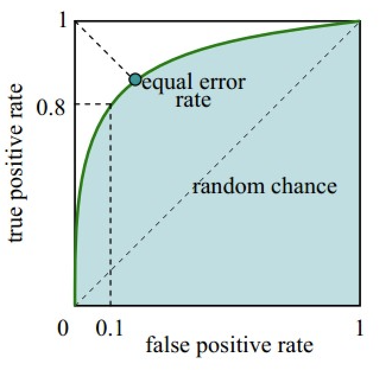

**精准率**: 也叫查准率，预测是正例的结果中，确实是正例的比例:  
*Precision = TP / (TP + FP)*

----
**召回率(准召率)**: 也叫查全率，所有正例样本中，被找出的概率:  
*Recall = TP / (TP + FN)*

----
**精确度**: 在所有样本中，识别正确的概率:  
*Accuracy = (TP + TN) / (TP + TN + FN + FP)*

----
**P-R曲线(PRC P-R Curve)**: 以召回率为x轴，查准率为y轴绘制的查准率和查全率之间的关系

绘制方法：
1. 假设已经得出一系列样本被划分为正类的概率score值，按照大小排序。
2. 从高到低，依次将“score”值作为阈值threshold，当测试样本属于正样本的概率大于或等于这个阈值时，我们认为它为正样本，否则为负样本。
3. 每次选取一个不同的阈值threshold，得到一组precision和recall，以recall值为横坐标、precision值为纵坐标，描点。
4. 根据3中的坐标点，绘制曲线。

R-P曲线的含义:  
- P-R曲线反映了精确率和召回率之间的关系。
- P-R曲线越凸向右上方，则模型的性能越好
- 如果一个模型的PRC被另一个模型的PRC完全包住，则后者性能优于前者。

平衡点: Precision = Recall时的取值，该值越大，表示该模型的效果越好

[1] [机器学习 | 模型评估方法（P-R曲线和ROC曲线）](https://blog.csdn.net/m0_65437885/article/details/133992609)

----
**F1-Score**: 通过计算查准率和查全率的调和平均数来衡量模型在保持精确率和召回率之间的平衡性能。适用于不平衡数据集或者需要平衡精确率和召回率的任务。如在医疗诊断中，F1值高的模型，不仅能识别大多数患病患者（高召回率），还能减少误诊（高准确率）。

----
**TPR**: True Positive Ratio，真正例率, 所有正例中，判定为positive的比率:   
*𝑇𝑃𝑅 = 𝑇𝑃 / (𝑇𝑃 + 𝐹𝑁)*

**FPR**: False Positive Ratio，假正例率，所有负例中，判定为positive的比率:  
 *FPR = FP / (TN + FP)*

**ROC**: 以FPR假正率为横坐标轴，TPR真正率为纵坐标绘制的曲线。  

1. 理想情况下，TPR应该接近1，FPR应该接近0，故ROC曲线越靠拢(0,1)点，越偏离45度对角线越好
2. ROC曲线上每个点对应一个threshold，对于一个分类器，每个threadshold对应一个TPR和一个FPR，当threadshold最大时，所有样本都被预测为negative阴性，TP=FP=0，对应于原点(0,0)；threshold最小时，所有样本都被预测为positive阳性，TN=FN=0，对应于右上角点(1,1)

举例: 在一个二分类模型中，对于所得到的预测结果，假设已确定一个阀值，比如说 0.6，大于这个值的实例划归为正类，小于这个值则划到负类中。如果减小阀值，减到0.5，固然能识别出更多的正类，也就是提高了识别出的正例占所有正例 的比类，即TPR,但同时也将更多的负实例当作了正实例，即提高了FPR。

**AUC**: Area Under ROC Curve，表示ROC曲线下的面积，用于衡量模型的泛化能力。由于ROC曲线最大覆盖一个 1 * 1 的正方形，当AUC=1时，模型能恰好100%正确识别所有正例，并0错误给出FP判定。

完美模型：AUC等于1，表示模型在所有阈值下都能完美区分正例和负例，具有最佳性能。  
优秀模型：AUC接近于1，通常在0.9到1之间，表示模型具有很好的性能，可以高度区分正例和负例。  
良好模型：AUC约为0.8到0.9之间，表明模型具有良好的性能，可以有效地区分正例和负例。  
合理模型：AUC约为0.7到0.8之间，表明模型的性能在一般情况下还可接受，但可能存在改进的空间。  
较差模型：AUC约为0.6到0.7之间。模型的性能相对较差，需要改进。  
无效模型：AUC小于0.6，模型的性能非常差，不能有效地区分正例和负例。

----
**mAP**: 目标检测任务中常用mAP指标来衡量目标检测精度。  
**AP**: Average Precision，对P-R曲线上的Precision值求均值。
通常来说AP是在单个类别下的，mAP是AP值在所有类别下的均值。

[1] [目标检测中的AP mAP](https://zhuanlan.zhihu.com/p/88896868)

----
BELU

[1] [机器翻译评测——BLEU算法详解](https://www.cnblogs.com/by-dream/p/7679284.html)  
[2] [BELU](https://paddlepedia.readthedocs.io/en/latest/tutorials/deep_learning/metrics/bleu.html)

----
ROUGE
[1] [ROUGE](https://paddlepedia.readthedocs.io/en/latest/tutorials/deep_learning/metrics/rouge.html)
