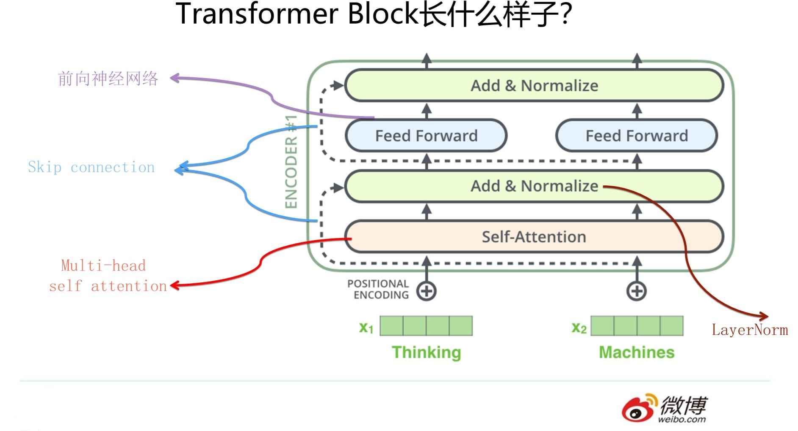

“Attention is all you need”论文中说的的Transformer指的是完整的Encoder-Decoder框架，而我这里是从特征提取器角度来说的，你可以简单理解为论文中的Encoder部分。因为Encoder部分目的比较单纯，就是从原始句子中提取特征，而Decoder部分则功能相对比较多，除了特征提取功能外，还包含语言模型功能，以及用attention机制表达的翻译模型功能。所以这里请注意，避免后续理解概念产生混淆。

Transformer原始论文一直重点在说Self Attention，但是目前来看，能让Transformer效果好的，不仅仅是Self attention，这个Block里所有元素，包括Multi-head self attention，Skip connection，LayerNorm，FF一起在发挥作用.

[1] [放弃幻想，全面拥抱Transformer：自然语言处理三大特征抽取器（CNN/RNN/TF）比较](https://zhuanlan.zhihu.com/p/54743941)

-------

[2] [从Word Embedding到Bert模型—自然语言处理中的预训练技术发展史](https://zhuanlan.zhihu.com/p/49271699)

[2-1] [BERT大火却不懂Transformer？读这一篇就够了](https://zhuanlan.zhihu.com/p/54356280)

---------

[3] [深度学习中的注意力模型（2017版）](https://zhuanlan.zhihu.com/p/37601161)

[4] [Attention Mechanisms and Transformers](https://d2l.ai/chapter_attention-mechanisms-and-transformers/index.html#)

[5] [The Illustrated BERT, ELMo, and co. (How NLP Cracked Transfer Learning)](https://jalammar.github.io/illustrated-bert/)

[6] [The Illustrated Transformer](https://jalammar.github.io/illustrated-transformer/)

[7] [The Annotated Transformer](https://nlp.seas.harvard.edu/2018/04/03/attention.html)

[7-1] [The Annotated Transformer](https://nlp.seas.harvard.edu/annotated-transformer/)

[8] [Dissecting BERT Part 1: The Encoder](https://medium.com/dissecting-bert/dissecting-bert-part-1-d3c3d495cdb3)

[9] [Attention is All you Need 全文翻译](https://zhuanlan.zhihu.com/p/682007654)

[10] [Q、K、V 与 Multi-Head Attention 多头注意力机制](https://zhuanlan.zhihu.com/p/669027091)