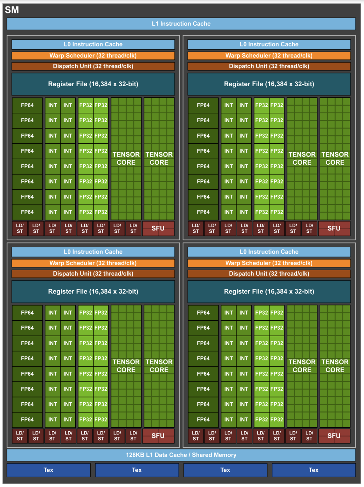

# Volta Architecture

Volta是Nvidia 2017年推出的新一代GPU架构。在Volta架构中，Nvidia引入多项新技术，如Tensor Core、Independent Thread Scheduling等，来加速深度学习的发展。

## Streaming Multiprocessor(SM)
Volta的SM较上一代Pascal有很多改进：
- CUDA Cores数量，同Pascal一样，Volta每个SM包含64个FP32 cores和32个FP64 core。然而和Pascal架构中，FP32和INT32共享同一个CUDA core不同，Volta SM包含了独立的FP32 core和INT32 core（如下图），从而Volta架构中FP32指令和INT32指令可以同时执行，这提高了Volta架构的指令吞吐，同时也缩减了FMA指令的指令延迟，特别的加快了混和了int地址计算和和float浮点运算的的循环操作将因此受益。
    >Unlike Pascal GPUs, which could not execute FP32 and INT32 instructions simultaneously, the Volta GV100 SM includes separate FP32 and INT32 cores, allowing simultaneous execution of FP32 and INT32 operations at full throughput, while also increasing instruction issue throughput. Dependent instruction issue latency is also reduced for core FMA (Fused Multiply-Add) math operations, requiring only four clock cycles on Volta, compared to six cycles on Pascal.
    Many applications have inner loops that perform pointer arithmetic (integer memory address calculations) combined with floating-point computations that will benefit from simultaneous execution of FP32 and INT32 instructions. Each iteration of a pipelined loop can update addresses (INT32 pointer arithmetic) and load data for the next iteration while simultaneously processing the current iteration in FP32.

- Processing Blocks的划分：
    - Pascal将每个SM划分为2个Processing Blocks，Volta将每个SM划分成4个Processing Blocks，对比如下：

        | Architecuture | Pascal | Volta |
        |---------------|--------|-------|
        | Processing Blocks / SM | 2 | 4 |
        | FP32 core / PB  | 32 | 16|
        | INT32 core / PB | *_无独立的INT32 core_ | 16|
        | FP64 core / PB  | 16 | 8|        
        | Tensor core / PB  | - | 2 |        
        | Warp Scheduler / PB | 1 | 1|
        | Dispatch Unit / PB  | 2 | 1|
        | Register File | 128Kb | 64Kb|
        | Instruction Buffer / PB | Y | - |
        | L0 Instruction Cache / PB | - | Y |

        此外，Volta将每个SM中的L1 DataCache和Shared Memory进行了合并，使得L1 Cache的访问效率像Shared Memory一样高（Shared Memory的访问效率较高？）。合并后的容量是128KB/SM。如果kernel没有使用到Shared Memory，则这128KB都会被当成L1 Data Cache使用，来对streaming data提供高带宽支持或者对频繁访问的数据提供低延迟访问支持，通过这种机制Volta缩小了显式Shared Memory和不使用shared memory直接访问device memory这两种操作键的性能gap。同时Volta的L1 Cache/Shared Memory也实现了对写的支持，进一步加速了性能。
        > Integration within the shared memory block ensures the Volta GV100 L1 cache has much lower latency and higher bandwidth than the L1 caches in past NVIDIA GPUs. The L1 In Volta functions as a high-throughput conduit for streaming data while simultaneously providing high-bandwidth and low-latency access to frequently reused data—the best of both worlds. This combination is unique to Volta and delivers more accessible performance than in the past.

### Tensor Core

## Independent Thread Scheduling(ITS)

### Cooperative Group