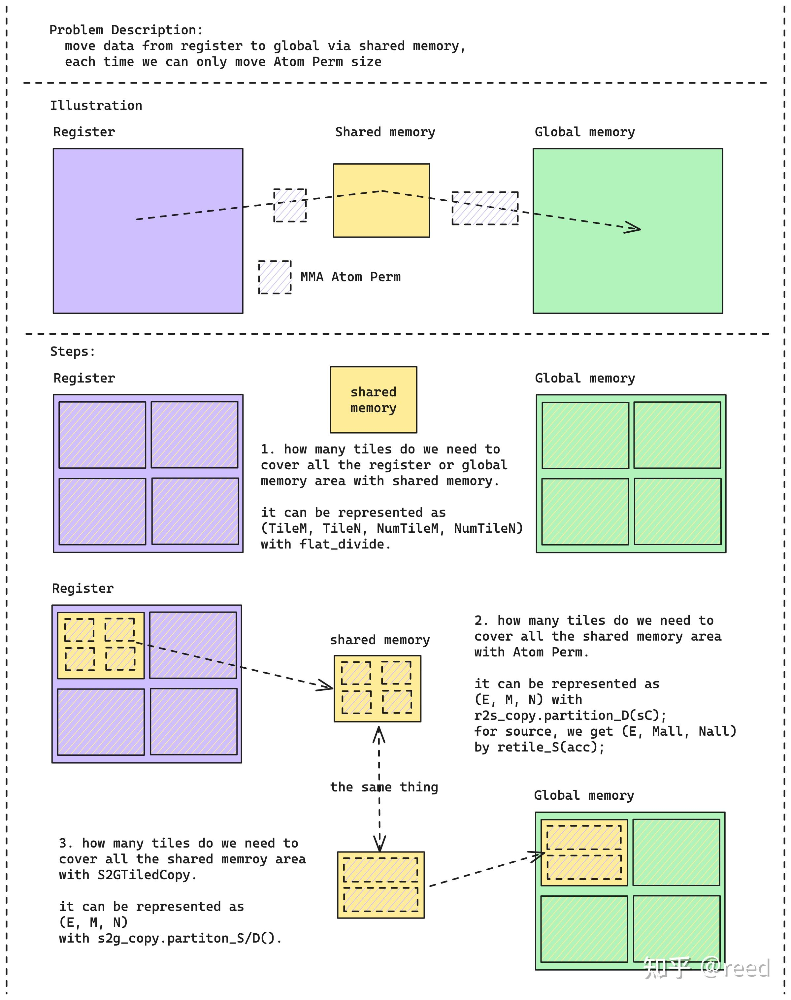

# 背景
当前模型部署大多是直接使用onnx转tensorrt engine直接调用，tensorrt针对常见模型接口有比较好的推理优化效果，但是对于一些特殊模型结构，往往不能有很好的优化效果。
本文已concat+conv+relu模型结构为例，分享如何进行推理过程中的大点抓取与优化

# 优化方法

## profile
一个性能优化的具体过程应该是：
发现问题->设计方案->实现方案->测试->上线
其中发现问题是最关键的一步。
针对模型推理优化，我们关心的是在车端环境下的推理效率。影响车端推理效率的主要因素可以分为两类
1. 模型本身的计算瓶颈
2. 资源竞争带来的性能退化


针对资源竞争带来的性能退化，需要依赖nsys抓取对应的计算过程进行发现；对于模型本身带来的性能瓶颈，则可以结合trt-engine-explorer进行分析，推荐22.04 ubuntu + python3.10进行测试
trt-engine-explorer的原理是通过trtexec profile出模型推理时的各个节点耗时，这个耗时和实际运行时的耗时会有一定的差异，如果想要非常准确的话可以使用nsys + NVTX。不过一般也就够了
在其中有几个比较有用的脚本可以供没有看过trt-engine-explorer源码的开发者直接调用，这里做下简单的介绍

1. process_engine.py

这个脚本的作用是针对输入的onnx\engine文件进行性能测试，并将对应的测试结果以svg图等形式输出
```
usage: process_engine.py [-h] [--print_only] [--build_engine] [--profile_engine] [--draw_engine] input outdir [trtexec [trtexec ...]]

Utility to build and profile TensorRT engines

positional arguments:
  input                 input file (ONNX or engine)
  outdir                directory to store output artifacts
  trtexec               trtexec commands not including the preceding -- (e.g. int8 shapes=input_ids:32x512,attention_mask:32x512

optional arguments:
  -h, --help            show this help message and exit
  --print_only          print the command-line and exit
  --build_engine, -b    build the engine
  --profile_engine, -p  engine the engine
  --draw_engine, -d     draw the engine
```

其余的脚本可以理解为这个脚本的子功能，不做具体使用介绍了

通过这个脚本能够看到各个节点的推理耗时


通过挖掘到的时延大点，可以根据name定位到在onnx中对应哪些阶段（netron），再通过这种方式了解这块完成了什么样的计算
之后，再通过nsys、ncu但是抓取trtexec inference的过程，通过分析各个资源的指标，确定推理慢的具体原因是什么

## cutlass
对于算子优化，必定绕不过gemm计算的过程，当前可供在计算内部自定义的最优计算库就是cutlass。
cutlass集成了大量的gemm计算优化方法，可以使conv、matmul等操作可以快速的进行自定义实现，并且性能效果不比tensorrt的优化效果差（单指纯计算部分）
cutlass当前针对ampere、hopper等架构的性能优化方法也有一定的区别，咱们暂时仅聚焦于ampere架构下的优化方案

在cutlass 3.0之后，引入了cute模块，cutlass整体的灵活性大幅上升


cute最最最重要的部分就是提供了多层的抽象，将复杂的计算问题，通过层层抽象，均匀高效的分配到各个thread上面，接下来，将会自底向上介绍各个层级的抽象（已一个gemm计算为例）

1. tensor

tensor是cute中，表达一个数组的格式，它是layout与数据存储head指针的组合。layout则可以视为一个函数，通过输入想要获得的矩阵内元素的坐标，获得该元素相对于head位置的offset。layout的具体表达分为两部分：stride以及shape。具体的计算规则如下
例如一个4x8的矩阵，按行数据存储，那么其对应的layout就应该为{shape={4, 8}, stride={8,1}}
对于第2行，第三列的元素，其偏移量为
$offset_{2. 3} = 2 * 8 + 3 * 1$
那么加入一个矩阵是由4个4x8的行数据存储的小矩阵拼接而成的8x16的矩阵由应该如何表达呢
实际上这就是在小矩阵基础上抽象出一个大矩阵的案例，其layout应该为{shape={{4, 2}， {8, 2}}, stride={{8, 64}, {1, 32}}}


通过tensor，我们可以很方便的去描述我们一个矩阵的数据排布
tensor可以通过()或者[]操作符，通过输入坐标，快速获得对应的元素
同时，我们也可以通过_符号或者slice函数，快速截取部分tensor生成一个新的tensor。例如上述tensor为A，则我们可以通过Tensor B=A((_, 1), (_, 1))获得蓝色部分矩阵，而不在需要考虑offset等问题
还有对应take、coalesce、group_modes、divide、product、tile、partition、fill、clear、axpby、以及make identity tensor等方法在后续使用时再做介绍，有兴趣的可以看下下方文档
https://www.zhihu.com/people/reed-84-49/posts
https://github.com/NVIDIA/cutlass/blob/main/media/docs/cute/03_tensor.md

2. MMA
tensor core的计算指令对应的实际操作就是一个D = A * B  + C的矩阵乘加运算。
要调用tensor core，我们需要把计算对应的数据拷贝到对应的register file中。
其实怎么写进去都可以，但是当前公认的最佳范式为建立G->S->R->S->G的数据读写过程。
在cuda 11中，引入了异步拷贝的概念，G->S不再需要通过register file进行过渡。


由于不需要寄存器了，就可以更大程度的提高并行度。
此外，通过建立G->S的pipeline，可以利用计算耗时掩盖拷贝耗时，进一步提高计算效率。这对mem bounded的核函数将会起到极大的性能提升。


此外，对于S->R，则有ldmatrix指令进行优化。在turning架构之前。我们只能够让每个线程自己去从shared mem中读取数据，在写到自己的寄存器上面。但是这就回造成一个尴尬的问题，我明明想要读一块比较大的连续数据，但是被迫每个线程只能读很小一块，连续性变得不再友好
在turning之后，我们则可以使用ldmatrix指令解决这个问题。ldmatrix协作式加载可以通过线程提供共享内存的地址（提供16Byte数据）完成数据的加载然后将数据分配到warp中各个线程的寄存器中，实现了跨越SIMT寄存器边界的写出，而如果是SIMT形式的加载，则只能使用更窄的数据位宽，这也就需要更多的指令完成等量数据的读写，同时ldmatrix由于是单线程提供16Byte的数据地址，warp内所有线程可以提供16Byte x 32 = 512Byte的数据到寄存器的加载，单指令实现16x16 float16矩阵的加载，减少指令数提高调度效率


上面说的是底层的优化原理，在cute中提供了抽象，让我们能够非常方便的去利用这些特性
在cute的gemm计算中，一般核函数每个block负责一个MMA tile的计算。一个block中的线程数则是由mma operator以及tiled mma中的AtomLayoutMNK以及PermutationsMNK决定

mma operator表示底层tensor core计算指令的选择，一遍能选大的就选大的，减少整体的指令数
AtomLayoutMNK则表示一个tiled mma在MNK三个方向上，需要多少warp去参与计算，这个值只要能把occupancy打满，就行
PermutationMNK则是表示一个warp在MNK上的重复计算次数
设置好了mma对应的参数，可以通过size(MMA{})的方式获取对应的block size
然后根据需要计算的ABCD矩阵大小进行grid size计算

完成了block的线程申请之后，我们进入到线程级内部的操作。gemm的计算实际上就是tensor的切分、copy input、tensor core调用计算、copy output这几个部分

首先显示tensor的切分。我们所有的输入，一开始肯定是都在global mem上面的。我们先需要找到当前block需要关注的数据在哪里
一般，我们先创建整个大矩阵对应的tensor，shape和stride都根据数据存储的方式进行决定

```
Tensor A = make_tensor(make_gmem_ptr((T *)Aptr), make_shape(Int<128>{}, Int<256>{}),
                         make_stride(Int<256>{}, Int<1>{}));
Tensor B1 = make_tensor(make_gmem_ptr((T *)Bptr), make_shape(n, k),
                         make_stride(Int<1>{}, Int<n>{}));  // (N, k)
Tensor D = make_tensor(make_gmem_ptr((OUT_T *)Dptr), make_shape(m, n),
                         make_stride(Int<n>{}, Int<1>{}));  // (M, N)
```

，然后，截取出当前tile需要关注的数据

```
Tensor gA = local_tile(A, make_tile(Int<kTileM>{}, Int<kTileK>{}),
                         make_coord(iy, _));  // (kTileM, kTileK, k)
Tensor gB = local_tile(B, make_tile(Int<kTileN>{}, Int<kTileK>{}),
                         make_coord(ix, _));  // (kTileN, kTileK, k)
Tensor gD = local_tile(D, make_tile(Int<kTileM>{}, Int<kTileN>{}),
                         make_coord(iy, ix));  // (kTileM, kTileN)
```

通过在第三维度(k)上面迭代计算，就能完成当前tile的计算

下一步，则是生成对应的shared_mem，并且将对应输入绑定到每个线程（即告诉每个线程它应该做什么）

```
auto sA = make_tensor(make_smem_ptr<T>(Ashm),
                        SmemLayoutA{});  // (kTileM, kTileK, kStage)
auto sB = make_tensor(make_smem_ptr(Bshm),
                        SmemLayoutB{});  // (kTileN, kTileK, kStage)
                        
G2SCopyA g2s_tiled_copy_a;
auto g2s_thr_copy_a = g2s_tiled_copy_a.get_slice(idx);
auto tAgA_copy = g2s_thr_copy_a.partition_S(gA);  // (CPY, CPY_M, CPY_K, k)
auto tAsA_copy = g2s_thr_copy_a.partition_D(sA);  // (CPY, CPY_M, CPY_K, kStage)

G2SCopyB g2s_tiled_copy_b;
auto g2s_thr_copy_b = g2s_tiled_copy_b.get_slice(idx);
auto tBgB_copy = g2s_thr_copy_b.partition_S(gB);  // (CPY, CPY_N, CPY_K, k)
auto tBsB_copy = g2s_thr_copy_b.partition_D(sB);  // (CPY, CPY_N, CPY_K, kStage)
```

同样的，将S->R的拷贝也绑定到每个线程

```
TiledMMA tiled_mma;
  auto thr_mma = tiled_mma.get_slice(idx);
  auto tCrA = thr_mma.partition_fragment_A(sA(_, _, 0));  // (MMA, MMA_M, MMA_K)
  auto tCrB = thr_mma.partition_fragment_B(sB(_, _, 0));  // (MMA, MMA_N, MMA_K)
  auto tCrD = thr_mma.partition_fragment_C(gD);           // (MMA, MMA_M, MMA_N)

  // fill zero for accumulator
  clear(tCrD);

  // if(idx == 0 && iy == 0 && ix == 0) print(sA(_, _, 0));
  // if(idx == 0 && iy == 0 && ix == 0) print(gA(_, _, 0));

  // gmem -cp.async-> shm -ldmatrix-> reg
  auto s2r_tiled_copy_a = make_tiled_copy_A(S2RCopyAtomA{}, tiled_mma);

  auto s2r_thr_copy_a = s2r_tiled_copy_a.get_slice(idx);
  auto tAsA = s2r_thr_copy_a.partition_S(sA);  // ? (CPY, CPY_M, CPY_K, kStage)
  auto tCrA_view = s2r_thr_copy_a.retile_D(tCrA);  // ? (CPY, CPY_M, CPY_K)

  auto s2r_tiled_copy_b = make_tiled_copy_B(S2RCopyAtomB{}, tiled_mma);
  auto s2r_thr_copy_b = s2r_tiled_copy_b.get_slice(idx);
  auto tBsB = s2r_thr_copy_b.partition_S(sB);  // ? (CPY, CPY_M, CPY_K, kStage)
  auto tCrB_view = s2r_thr_copy_b.retile_D(tCrB);  // ? (CPY, CPY_M, CPY_K)
```

完成了绑定之后，发起异步拷贝，并完成计算，并建立计算拷贝的pipeline，整个过程是G->S->R的过程，为啥需要这样呢，global mem读取大约需要400个时钟周期，shared mem则需要约30个，register file则是个位数时钟周期就可以读了，通过多级缓存，我们可以将读取数据的耗时与计算进行overlap隐藏

```
  cute::copy(g2s_tiled_copy_a, tAgA_copy(_, _, _, itile_to_read),
    tAsA_copy(_, _, _, 0));
  cute::copy(g2s_tiled_copy_b, tBgB_copy(_, _, _, itile_to_read),
    tBsB_copy(_, _, _, 0));
  cp_async_fence();

  ++itile_to_read;
  ++ismem_write;

  cute::copy(g2s_tiled_copy_a, tAgA_copy(_, _, _, itile_to_read),
    tAsA_copy(_, _, _, 1));
  cute::copy(g2s_tiled_copy_b, tBgB_copy(_, _, _, itile_to_read),
    tBsB_copy(_, _, _, 1));
  cp_async_fence();

  ++itile_to_read;
  ++ismem_write;

  // wait one submitted gmem->smem done
  cp_async_wait<kStage - 2>();
  __syncthreads();

  int ik = 0;
  // smem -> reg
  cute::copy(s2r_tiled_copy_a, tAsA(_, _, ik, ismem_read), tCrA_view(_, _, ik));
  cute::copy(s2r_tiled_copy_b, tBsB(_, _, ik, ismem_read), tCrB_view(_, _, ik));

  // loop over k: i. load tile, ii. mma
  int ntile = k / kTileK + 1;
#pragma unroll
  for (int itile = 0; itile < ntile; ++itile) {
    int nk = size<2>(tCrA);

#pragma unroll
    for (int ik = 0; ik < nk; ++ik) {
      int ik_next = (ik + 1) % nk;

      if (ik == nk - 1) {
        cp_async_wait<kStage - 2>();
        __syncthreads();

        ismem_read = (ismem_read + 1) % kStage;
      }

      // shm -> reg s[itile][ik + 1] -> r[ik + 1]
      cute::copy(s2r_tiled_copy_a, tAsA(_, _, ik_next, ismem_read),
                 tCrA_view(_, _, ik_next));
      cute::copy(s2r_tiled_copy_b, tBsB(_, _, ik_next, ismem_read),
                 tCrB_view(_, _, ik_next));

      if (ik == 0) {
        if (itile_to_read < ntile) {
          cute::copy(g2s_tiled_copy_a, tAgA_copy(_, _, _, itile_to_read),
            tAsA_copy(_, _, _, ismem_write));
          cute::copy(g2s_tiled_copy_b, tBgB_copy(_, _, _, itile_to_read),
            tBsB_copy(_, _, _, ismem_write));
          ++itile_to_read;
          ismem_write = (ismem_write + 1) % kStage;
        }

        cp_async_fence();
      }

      cute::gemm(tiled_mma, tCrD, tCrA(_, _, ik), tCrB(_, _, ik), tCrD);
    }  // for ik
  }
```

上面代码的过程对应如下过程


在完成计算之后，所有数据都存在了tCrD中，需要将它们写到对应的global mem当中，需要同样需要做R->S->G，这部分不用使用异步进行隐藏了（没有计算了）

```
OUT_T* Cshm = reinterpret_cast<OUT_T*>(Ashm);
  auto sC = make_tensor(Cshm, SmemLayoutC{});
  Tensor cC = make_identity_tensor(make_shape(size<0>(sC), size<1>(sC)));

  auto r2s_tiled_copy_c = make_tiled_copy_C(R2SCopyAtomC{}, tiled_mma);
  auto r2s_thr_copy_c = r2s_tiled_copy_c.get_slice(idx);
  auto tCrC_r2s = r2s_thr_copy_c.retile_S(tCrD);   // (CPY, CPY_M, CPY_N)
  auto tCsC_r2s = r2s_thr_copy_c.partition_D(sC);  // (CPY, _1, _1, pipe)

  S2GCopyC s2g_tiled_copy_c;
  auto s2g_thr_copy_c = s2g_tiled_copy_c.get_thread_slice(idx);
  auto tCsC_s2g = s2g_thr_copy_c.partition_S(sC);  // (CPY, _1, _1, pipe)
  auto tCgC_s2g = s2g_thr_copy_c.partition_D(gD);  // (CPY, CPY_M, CPY_N)

  auto tCgC_s2gx = group_modes<1, 3>(tCgC_s2g);  // (CPY_, CPY_MN)
  auto tCrC_r2sx = group_modes<1, 3>(tCrC_r2s);  // (CPY_, CPY_MN)
  
  int step = size<3>(tCsC_r2s);  // pipe
#pragma unroll
  for (int i = 0; i < size<1>(tCrC_r2sx); i += step) {
    // reg -> shm
#pragma unroll
    for (int j = 0; j < step; ++j) {
      for (int id = 0; id < size(tCrC_r2sx(_, i + j)); ++id) {
        tCrC_r2sx(_, i + j)(id) = fmax(tCrC_r2sx(_, i + j)(id), 0.0f);
      }
      // cute::copy(tCrC_r2sx(_, i + j), t);

      cute::copy(r2s_tiled_copy_c, tCrC_r2sx(_, i + j), tCsC_r2s(_, 0, 0, j));
    }
    __syncthreads();

    // shm -> global
#pragma unroll
    for (int j = 0; j < step; ++j) {
      cute::copy(s2g_tiled_copy_c, tCsC_s2g(_, 0, 0, j), tCgC_s2gx(_, i + j));
    }

    __syncthreads();
  }
```

这边就会有疑问了，为啥还要写到shared mem呢，不如直接写到global mem，这不是多此一举吗
最最主要的原因，是在寄存器上，数据并不是连续的，不能128字节字节的写，这就会造成cache line的浪费，降低击中率
因此通过shared mem做过渡，就能很好的解决这个问题



## 结语
gpu计算是个非常复杂的问题，常常会在觉得自己已经优无可优的时候发现别的大佬在最根本的想法上就把你碾压了。现在最强优化（NVIDIA cublas、deepseek）的佬们已经开始通过基于nvjet汇编器进行优化了，so希望能通过这次分享抛砖引玉，针对当前系统挖掘出更多的优化点，将ampere系统下的计算性能进行充分挖掘